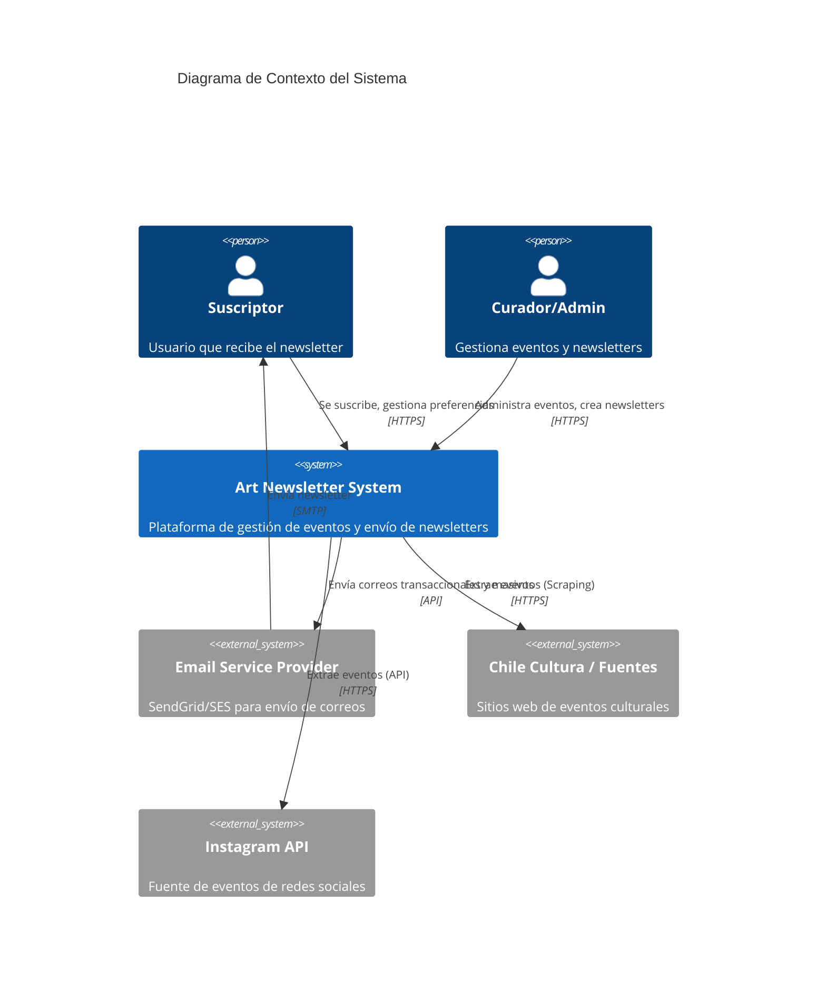
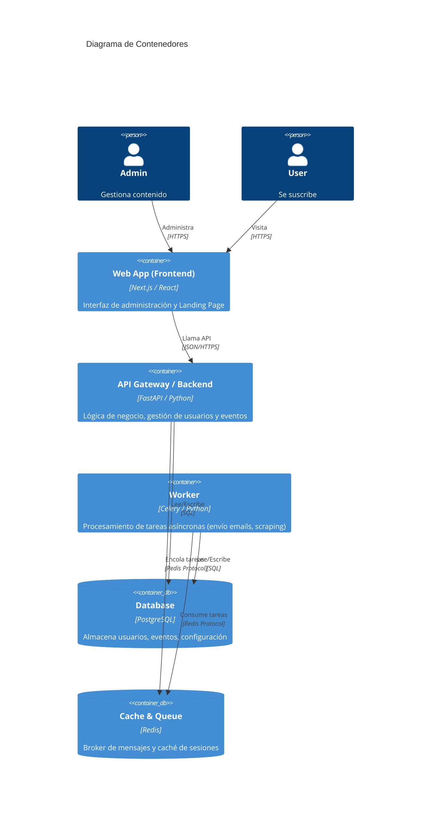
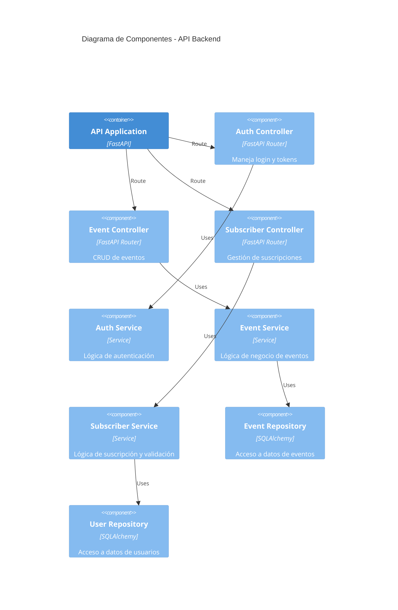

# Arquitectura del Sistema - Art Newsletter Chile

## Diagrama de Contexto (Nivel 1)
Describe las interacciones del sistema con usuarios y sistemas externos.

## Diagrama de Contenedores (Nivel 2)
Muestra las aplicaciones y bases de datos principales.

## Diagrama de Componentes (Backend) (Nivel 3)
Detalle de componentes internos de la API.

